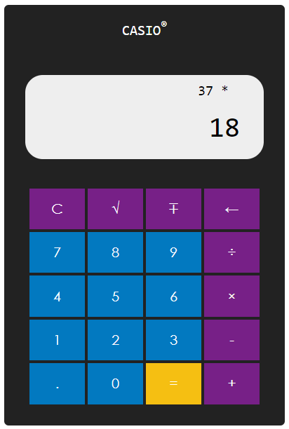

# Calculator

Same old boring calculator. See it live [here](https://zbhavyai.github.io/same-old-calculator/).

## Features

+ Usual features of a calculator

+ Can be used via clicking onscreen buttons or using key strokes on the keyboard

+ When using keyboard, use

   + Enter for =

   + Backspace for &larr;

   + p for &#8723;

   + s for &#8730;

## How to run

1. Clone the repository on your machine

2. Open the [index.html](index.html) file in your browser

## Screenshots

